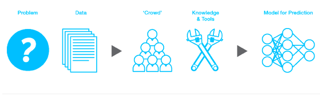

#Kaggle Playground

This repository contains my my approaches, solutions for [Kaggle Competitions](http://www.kaggle.com). Will provide detailed walkthrough on every problems for anyone to get started to practically apply Machine learning. Most of the solutions will be coded up in R. Would have used python if the problems demands it. The problems are all about Machine Learning and Data Science. Feel free to discuss any subject related with the competitions.

